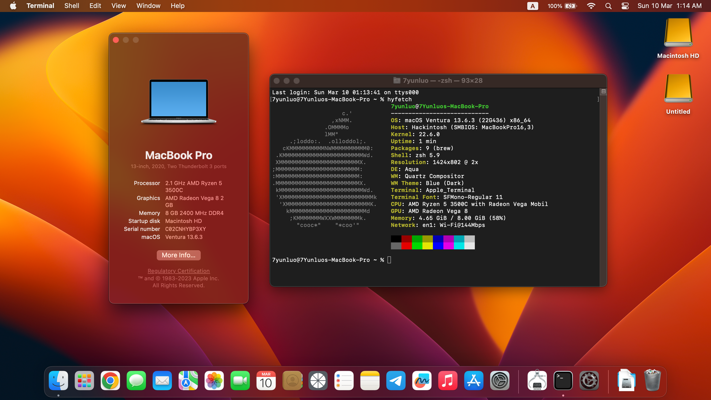

# Lenovo ThinkPad C13 Yoga ChromeBook R5-3500C Hackintosh EFI

### ThinkPad C13 Yoga ChromeBook

Use OpenCore 0.9.8

| Category  | Component                                            | 
| --------- | ---------------------------------------------------- |
| CPU       | AMD Ryzen 5 3500C                                    | 
| GPU       | AMD Radeon Vega 8 Graphics                           |
| SSD       | HP EX900 500GB NVME                                  |
| Memory    | 8GB DDR4                                             |
| Wifi & BT | Intel AX210 *Replaced                                | 
| Sound     | ACP3xALC5682M98357                                   |

### What's working
- [x] Battery percentage
- [x] Wifi and Bluetooth - AX210 (Origin wifi module is not working)
- [x] CPU power management
- [x] GPU hardware acceleration / performance
- [x] USB Ports
- [x] Web camera
- [x] HDMI

### What's not working ⚠️
- [ ] Keyboard *will not work after using for a while
- [ ] Keyboard backlight
- [ ] TouchPad,TouchScreen,Trackpoint,ClickPad
- [ ] Sound devices
- [ ] Sleep/Wake
- [ ] SD Card reader